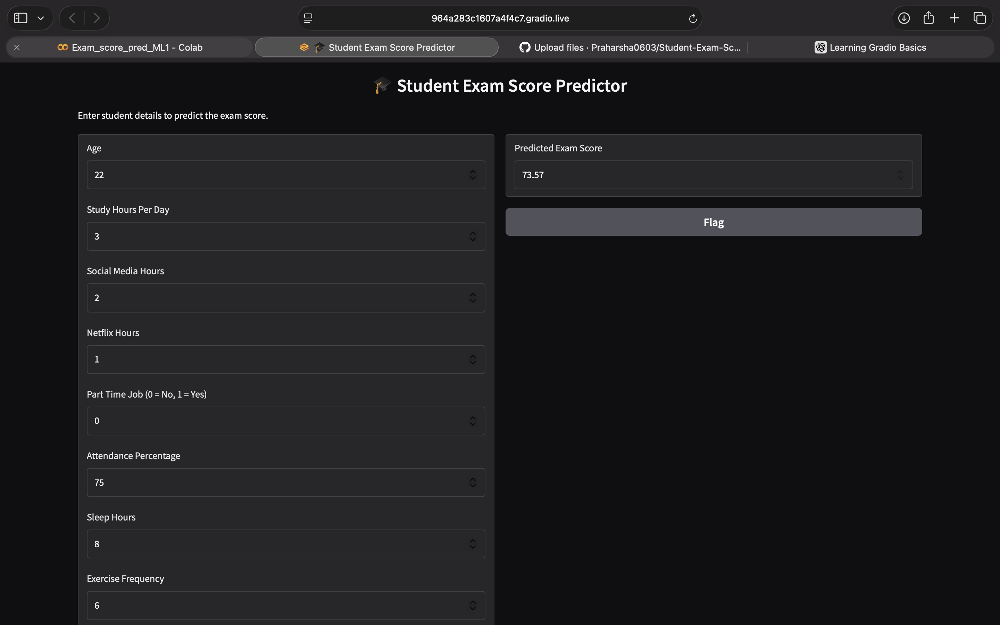
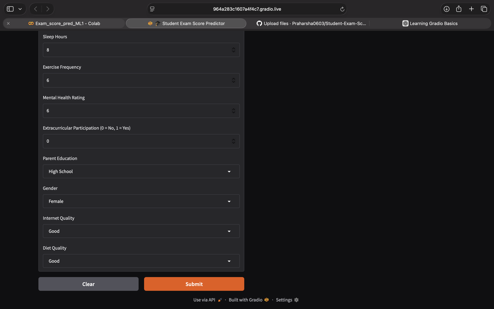

# 🎓 Student Exam Score Prediction using Machine Learning

## 📌 Project Overview

This project predicts student exam scores using Machine Learning techniques based on academic, lifestyle, and personal factors.

The objective is to analyze how different student habits affect academic performance and build models capable of predicting exam scores accurately.

---

## 🚀 Features

* Data Cleaning and Preprocessing
* Exploratory Data Analysis (EDA)
* Feature Engineering
* Multiple Regression Models
* Model Performance Comparison
* Gradio Web Application for Predictions

---

## 📊 Dataset Features

The dataset includes:

* Age
* Study Hours Per Day
* Social Media Hours
* Netflix Hours
* Part-Time Job Status
* Attendance Percentage
* Sleep Hours
* Exercise Frequency
* Mental Health Rating
* Extracurricular Participation
* Parental Education Level
* Gender
* Internet Quality
* Diet Quality

### 🎯 Target Variable

* Exam Score

---

## 🧹 Data Preprocessing

The following preprocessing techniques were applied:

* Missing Value Handling
* Label Encoding
* One-Hot Encoding using `get_dummies()`
* Train-Test Split

---

## 📈 Exploratory Data Analysis

Performed:

* Correlation Heatmap
* Feature Distribution Analysis
* Student Habit Analysis
* Relationship between Features and Exam Scores

---

## 🤖 Machine Learning Models

Three regression models were trained and evaluated:

### 1. Linear Regression

Baseline model for score prediction.

### 2. Decision Tree Regressor

Captures non-linear relationships in the dataset.

### 3. Random Forest Regressor

Ensemble model that combines multiple decision trees for improved performance.

---

## 📏 Evaluation Metrics

Models were evaluated using:

* R² Score
* Mean Absolute Error (MAE)
* Root Mean Squared Error (RMSE)

---

## 🌐 Gradio Application

A Gradio web application was developed to allow users to:

* Enter student information
* Select categorical values using dropdown menus
* Predict exam scores instantly

## Application Screenshots

### Gradio Interface



### Prediction Result


---

## 🛠️ Tech Stack

* Python
* Pandas
* NumPy
* Matplotlib
* Seaborn
* Scikit-Learn
* Gradio

---

## 📂 Repository Structure

```text
Student-Exam-Score-Prediction-ML
│
├── Notebook/
│   └── Exam_score_pred_ML1-4.ipynb
│
├── Dataset/
│   └── student_habits_performance.csv
│
├── Models/
│   ├── Linear Regression Model.png
│   ├── Decision Tree Model.png
│   └── Random Forest Model.png
│
├── Screenshots/
│   ├── ss1.png
│   └── ss2.png
│
└── README.md
```

---

## 🔮 Future Improvements

* Hyperparameter Tuning
* Additional Regression Models
* Model Deployment on Hugging Face Spaces
* Interactive Dashboard Enhancements

---

## 👨‍💻 Author

**Praharsha Palli**

Master's in Data Science Student
Machine Learning & Data Analytics Enthusiast
